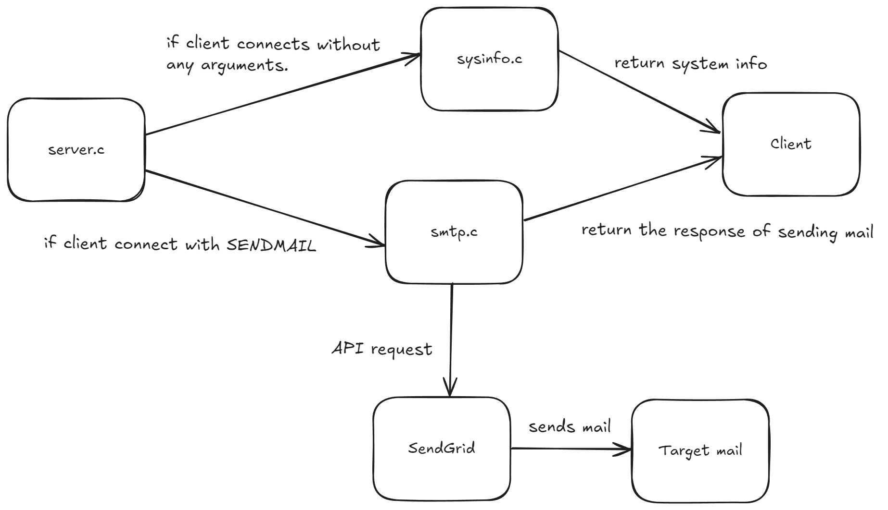

# Server-Client Application

A simple client-server application that can query system information or send emails.

## System Design Explanation

This application follows a traditional client-server architecture with the following components:

- **Server**: A multi-process server that listens on `127.0.0.1:9734` and handles client requests using the fork-based concurrency model
- **Client**: A command-line client that connects to the server to query system information or send emails
- **Communication Protocol**: Simple text-based protocol over TCP sockets using newline-delimited messages

The server supports two main operations:
1. **System Information Query**: Returns hostname, system resources, network interfaces, and environment variables
2. **Email Sending**: Sends emails via SendGrid API using credentials from `.env` file

### Server High level Architecture




## Server handles at least 10 clients concurrently

The server uses a fork-based architecture to handle multiple clients concurrently. Each client connection is processed in a separate child process.

### Testing Concurrent Connections

Launch 10 client instances at once using the following command:
```bash
for i in {1..10}; do ./build/bin/client & done
```

The server uses `fork()` to create a separate child process for each client connection, allowing true parallel processing. The parent process continues listening for new connections while child processes handle individual client requests independently.


### Concurrency Model

- **Process-based**: Each client connection runs in its own process
- **Signal Handling**: SIGCHLD is handled to prevent zombie processes
- **Resource Isolation**: Each client process has its own memory space
- **Fault Tolerance**: If one client process crashes, others continue unaffected


## Packet capture and analysis

You can capture and analyze network packets between the client and server using tools like `tcpdump` or `wireshark`.

### Using tcpdump

```bash
# Capture packets on localhost port 9734
sudo tcpdump -i lo -w capture.pcap port 9734

# Or monitor in real-time
sudo tcpdump -i lo -X port 9734
```

### Using wireshark

1. Start capturing on loopback interface (`lo`)
2. Filter by `tcp.port == 9734`
3. Analyze the TCP handshake, data exchange, and connection termination

### Protocol Analysis

The communication follows a simple text protocol:
- Client sends commands as text lines terminated with `\n`
- Server responds with text output, also newline-terminated
- Commands: `SENDMAIL` (with email details) or any other command (defaults to system info)


## Two levels of debug log control

The application implements a two-tier debug logging system for flexible debugging:

### Compile-time Control

Enable debug log support during compilation:
```bash
cmake -DBUILD_DEBUG=ON ..
make
```

When `BUILD_DEBUG=ON`, the `DEBUG` macro is defined, enabling `INFO_LOG`, `WARN_LOG`, and `DEBUG_LOG` macros. Without it, these macros become no-ops.

### Runtime Control

Enable/disable debug logs at runtime using environment variables or command-line arguments:

**Environment Variables:**
```bash
DEBUG_LOG=1 ./build/bin/server
DEBUG_LOG=1 DEBUG_LOG_LEVEL=3 ./build/bin/client
```

**Command-line Arguments:**
```bash
./build/bin/server --debug 3
./build/bin/client -d 2
```

### Log Levels

- `LOG_ERROR` (0): Always enabled, critical errors
- `LOG_WARN` (1): Warnings, requires compile-time and runtime enable
- `LOG_INFO` (2): Informational messages, requires compile-time and runtime enable
- `LOG_DEBUG` (3): Detailed debug information, requires compile-time and runtime enable


## Shared library (.so) for common utility functions

Common utility functions shared by both client and server are encapsulated into a dynamic shared library (`libutility.so`) to avoid code duplication and enable easier maintenance.

### Architecture

```
utility (libutility.so) - Shared library
  └── debug.c          - Debug logging functions

server
  ├── server.c, sysinfo.c, smtp.c, env.c
  └── Links: utility, libcurl

client
  ├── client.c
  └── Links: utility
```

### Benefits

- **Code Reusability**: Debug logging functions are shared between client and server
- **Maintainability**: Changes to debug functionality only need to be made in one place
- **Memory Efficiency**: Shared library code is loaded once and shared across processes
- **Modularity**: Clear separation between shared utilities and application-specific code

## Robustness mechanisms

The application implements comprehensive error handling and robustness mechanisms to ensure reliable operation:

### Error Handling Coverage

- **System Call Errors**: All system calls (socket, bind, accept, fork, etc.) check return values
- **Memory Management**: All malloc() and strdup() calls check for NULL returns
- **File I/O**: fopen(), fgets(), fprintf(), fclose() all have error handling
- **Network Operations**: Socket operations include proper error checking and resource cleanup
- **Signal Handling**: SIGCHLD and SIGPIPE are properly handled to prevent crashes

### Key Features

- **Graceful Degradation**: Single operation failures don't crash the server
- **Resource Cleanup**: All error paths properly clean up allocated resources
- **Error Logging**: Comprehensive logging system with multiple log levels
- **Input Validation**: NULL checks, empty string checks, and buffer overflow protection

For detailed information, see [ROBUSTNESS.md](ROBUSTNESS.md) and [ROBUSTNESS_EXAMPLES.md](ROBUSTNESS_EXAMPLES.md).


## Build system

The project uses CMake as the build system for cross-platform compatibility and dependency management.

### Build Steps

```bash
mkdir build && cd build
cmake ..
make
```

### Build Options

- **BUILD_DEBUG**: Enable compile-time debug log support
  ```bash
  cmake -DBUILD_DEBUG=ON ..
  ```

### Output Structure

```
build/
├── bin/
│   ├── server       # Server executable
│   └── client       # Client executable
└── lib/
    └── libutility.so # Shared utility library
```

### Dependencies

- **CMake** 3.10 or higher
- **libcurl** (for email sending functionality)
- **C99 compiler** (GCC or Clang)

### Installation

```bash
cd build
make install
```

This installs executables to `/usr/local/bin` and libraries to `/usr/local/lib` (default paths, configurable via CMake).

