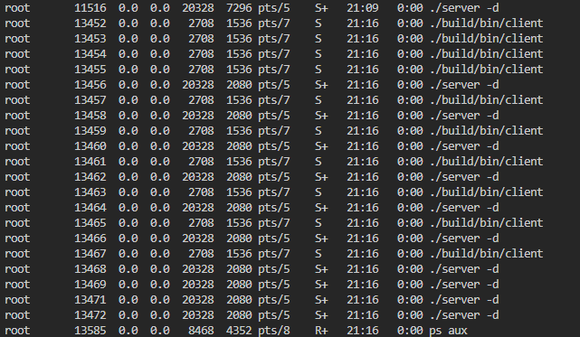
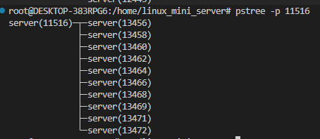
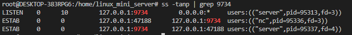
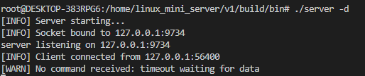
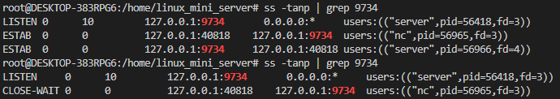
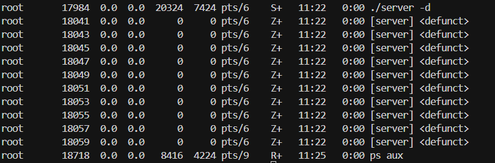
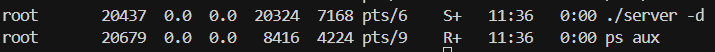
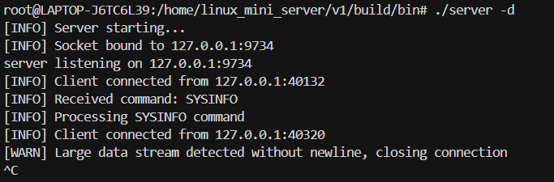
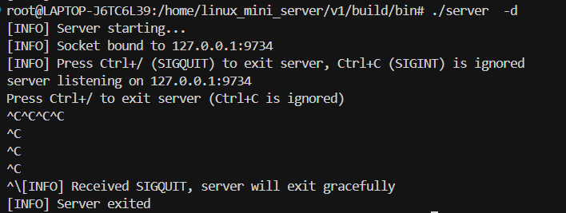

# Server-Client Application

A simple client-server application that can query system information or send emails.

## System Design Explanation

This application follows a traditional client-server architecture with the following components:

- **Server**: A multi-process server that listens on `127.0.0.1:9734` and handles client requests using the fork-based concurrency model
- **Client**: A command-line client that connects to the server to query system information or send emails
- **Communication Protocol**: Simple text-based protocol over TCP sockets using newline-delimited messages

The server supports two main operations:
1. **System Information Query**: Returns hostname, system resources, network interfaces, and environment variables
2. **Email Sending**: Sends emails via SendGrid API using credentials from `.env` file

### Server High level Architecture


## SENDMAIL Implementation

The SENDMAIL feature sends emails through SendGrid API. The flow is: Client → Server → `send_email()` → SendGrid API.

### Client Command Format

```bash
./build/bin/client SENDMAIL [recipient] [subject] [body]
```

Default values: `qwe638853@gmail.com`, `Test Subject`, `Hello from socket client`.

The client sends parameters as a pipe-delimited string: `SENDMAIL|to|subject|body\n`

```123:134:v1/src/client.c
    if (cmd_idx < argc && strcmp(argv[cmd_idx], "SENDMAIL") == 0) {
        // Send email mode
        INFO_LOG(stderr, "Sending SENDMAIL command\n");
        const char *to = (cmd_idx + 1 < argc) ? argv[cmd_idx + 1] : "qwe638853@gmail.com";
        const char *subject = (cmd_idx + 2 < argc) ? argv[cmd_idx + 2] : "Test Subject";
        const char *body = (cmd_idx + 3 < argc) ? argv[cmd_idx + 3] : "Hello from socket client";

        DEBUG_LOG(stderr, "Email details - To: %s, Subject: %s\n", to, subject);

        // Send all parameters in one line, separated by | (pipe character)
        // Format: SENDMAIL|to|subject|body
        if(fprintf(server_fp, "SENDMAIL|%s|%s|%s\n", to, subject, body) < 0){
```

### Server Processing

The server parses the command using `strtok()` and calls `send_email()`:

```306:349:v1/src/server.c
                if (strncmp(command, "SENDMAIL", 8) == 0) {
                    INFO_LOG(stderr, "Processing SENDMAIL command\n");
                    // Parse parameters from command line (format: SENDMAIL|to|subject|body)
                    char *token = strtok(command, "|");
                    if (token != NULL && strcmp(token, "SENDMAIL") == 0) {
                        // Parse 'to'
                        token = strtok(NULL, "|");
                        if (token != NULL) {
                            strncpy(to, token, sizeof(to) - 1);
                            to[sizeof(to) - 1] = '\0';
                            DEBUG_LOG(stderr, "To: %s\n", to);
                        }
                        // Parse 'subject'
                        token = strtok(NULL, "|");
                        if (token != NULL) {
                            strncpy(subject, token, sizeof(subject) - 1);
                            subject[sizeof(subject) - 1] = '\0';
                            DEBUG_LOG(stderr, "Subject: %s\n", subject);
                        }
                        // Parse 'body'
                        token = strtok(NULL, "|");
                        if (token != NULL) {
                            strncpy(body, token, sizeof(body) - 1);
                            body[sizeof(body) - 1] = '\0';
                            DEBUG_LOG(stderr, "Body length: %zu\n", strlen(body));
                        }
                    }
                    
                    // Process email sending (can call send_email function here)
                    if(fprintf(client_fp, "Command: SENDMAIL\n") < 0 ||
                       fprintf(client_fp, "To: %s\n", to) < 0 ||
                       fprintf(client_fp, "Subject: %s\n", subject) < 0 ||
                       fprintf(client_fp, "Body: %s\n", body) < 0){
                        WARN_LOG(stderr, "Failed to write response to client\n");
                    }
                    
                    INFO_LOG(stderr, "Sending email to %s\n", to);
                    if(send_email(to, subject, body) < 0){
                        ERROR_LOG(stderr, "Failed to send email to %s\n", to);
                        fprintf(client_fp, "Error: Failed to send email\n");
                    } else {
                        INFO_LOG(stderr, "Email sent successfully to %s\n", to);
                        fprintf(client_fp, "Email sent successfully\n");
                    }
```

### SendGrid API Integration

The `send_email()` function (in `smtp.c`) handles SendGrid API integration:

1. **Load credentials** from `.env` file: `SENDGRID_API_KEY` and `SENDGRID_FROM`
2. **Build JSON payload** with escaped subject and body
3. **Send HTTPS POST** to `https://api.sendgrid.com/v3/mail/send` using libcurl with Bearer token authentication
4. **Check response** - expects HTTP 202 for success

```200:241:v1/src/smtp.c
    curl_easy_setopt(curl, CURLOPT_HTTPHEADER, headers);
    curl_easy_setopt(curl, CURLOPT_URL, "https://api.sendgrid.com/v3/mail/send");
    curl_easy_setopt(curl, CURLOPT_POST, 1L);
    curl_easy_setopt(curl, CURLOPT_POSTFIELDS, payload);
    curl_easy_setopt(curl, CURLOPT_POSTFIELDSIZE, (long)strlen(payload));
    curl_easy_setopt(curl, CURLOPT_ERRORBUFFER, errbuf);
    curl_easy_setopt(curl, CURLOPT_TIMEOUT, 20L);
    curl_easy_setopt(curl, CURLOPT_CONNECTTIMEOUT, 10L);
    DEBUG_LOG(stderr, "send_email: CURL options set, sending request...\n");

    CURLcode res = curl_easy_perform(curl);
    
    int http_code = 0;
    if (res != CURLE_OK){
        ERROR_LOG(stderr, "curl_easy_perform failed: %s\n", errbuf);
        fprintf(stderr, "curl_easy_perform failed: %s\n", errbuf);
    } else {
        CURLcode getinfo_res = curl_easy_getinfo(curl, CURLINFO_RESPONSE_CODE, &http_code);
        if(getinfo_res != CURLE_OK){
            WARN_LOG(stderr, "curl_easy_getinfo() failed, using default http_code 0\n");
            http_code = 0;
        } else {
            INFO_LOG(stderr, "send_email: HTTP response code: %d\n", http_code);
        }
    }

    curl_easy_cleanup(curl);
    curl_slist_free_all(headers);
    free(payload);

    if (res != CURLE_OK) {
        return -1;
    }

    if (http_code != 202) {
        ERROR_LOG(stderr, "SendGrid API returned error: %d\n", http_code);
        fprintf(stderr, "SendGrid API returned error: %d\n", http_code);
        return -1;
    }

    INFO_LOG(stderr, "send_email: Email sent successfully\n");
    return 0;
```


## Server handles at least 10 clients concurrently

The server uses a fork-based architecture to handle multiple clients concurrently. Each client connection is processed in a separate child process.

### Testing Concurrent Connections

Launch 10 client instances at once using the following command:
```bash
for i in {1..10}; do ./build/bin/client & done
```

The server uses `fork()` to create a separate child process for each client connection, allowing true parallel processing. The parent process continues listening for new connections while child processes handle individual client requests independently.



We also verified the process hierarchy using pstree



### Concurrency Model

- **Process-based**: Each client connection runs in its own process
- **Signal Handling**: SIGCHLD is handled to prevent zombie processes
- **Resource Isolation**: Each client process has its own memory space
- **Fault Tolerance**: If one client process crashes, others continue unaffected


## Packet capture and analysis

This section demonstrates the process of capturing and analyzing TCP communication between the client and server using tcpdump and Wireshark.

### Capture Packets with `tcpdump`

```bash
# Capture packets on localhost port 9734
sudo tcpdump -i lo -w capture.pcap port 9734
```
After running this command while the client and server are communicating, press Ctrl + C to stop capturing.
A file named capture.pcap will be generated.

### Analyze with `Wireshark`

```bash
wireshark capture.pcap
```
Open the capture.pcap file with Wireshark to visualize the TCP handshake and data exchange.


### TCP Handshake and Data Flow Analysis


From the capture above:

Packets 1–3 represent the three-way handshake (SYN → SYN/ACK → ACK) between the client and server.

Packets 4–12 show the data transfer phase, where the client and server exchange PSH, ACK packets (data segments).

Packets 13–14 show the connection termination (FIN, ACK → ACK).

Source and Destination: Both are 127.0.0.1, indicating communication over the loopback interface (local testing).
Protocol: TCP (Transmission Control Protocol).
Ports: Client (37118) ↔ Server (9734).


## Two levels of debug log control

The application implements a two-tier debug logging system for flexible debugging:

### Compile-time Control

Enable debug log support during compilation:
```bash
cmake -DBUILD_DEBUG=ON ..
make
```

When `BUILD_DEBUG=ON`, the `DEBUG` macro is defined, enabling `INFO_LOG`, `WARN_LOG`, and `DEBUG_LOG` macros. Without it, these macros become no-ops.

### Runtime Control

Enable/disable debug logs at runtime using environment variables or command-line arguments:

**Environment Variables:**
```bash
DEBUG_LOG=1 ./build/bin/server
DEBUG_LOG=1 DEBUG_LOG_LEVEL=3 ./build/bin/client
```

**Command-line Arguments:**
```bash
./build/bin/server --debug 
./build/bin/client -d 
```

### Log Levels

- `LOG_ERROR` (0): Always enabled, critical errors
- `LOG_WARN` (1): Warnings, requires compile-time and runtime enable
- `LOG_INFO` (2): Informational messages, requires compile-time and runtime enable
- `LOG_DEBUG` (3): Detailed debug information, requires compile-time and runtime enable


## Shared library (.so) for common utility functions

Common utility functions shared by both client and server are encapsulated into a dynamic shared library (`libutility.so`) to avoid code duplication and enable easier maintenance.

### Architecture

```
utility (libutility.so) - Shared library
  └── debug.c          - Debug logging functions

server
  ├── server.c, sysinfo.c, smtp.c, env.c
  └── Links: utility, libcurl

client
  ├── client.c
  └── Links: utility
```

### Benefits

- **Code Reusability**: Debug logging functions are shared between client and server
- **Maintainability**: Changes to debug functionality only need to be made in one place
- **Memory Efficiency**: Shared library code is loaded once and shared across processes
- **Modularity**: Clear separation between shared utilities and application-specific code

## Robustness mechanisms

The application implements comprehensive error handling and robustness mechanisms to ensure reliable operation:

### 1) Read Timeout Protection (Prevent Infinite Blocking)

#### Description
Before reading client commands, the server uses `select()` to check whether the socket is ready for reading with a 30-second timeout.  
If no data is received within this period, the server logs a warning and safely terminates the child process.  
This prevents a blocked child process from consuming system resources indefinitely.

#### Key Code Snippet
```c
// Use select() to check socket readability with a timeout
fd_set readfds;
struct timeval select_timeout;
FD_ZERO(&readfds);
FD_SET(cfd, &readfds);
select_timeout.tv_sec = 30;
select_timeout.tv_usec = 0;

int select_result = select(cfd + 1, &readfds, NULL, NULL, &select_timeout);
if (select_result <= 0) {
    if (select_result == 0) {
        WARN_LOG(stderr, "No command received: timeout waiting for data\n");
    } else {
        WARN_LOG(stderr, "No command received: select() error\n");
        perror("select");
    }
    cleanup_and_exit(client_fp, cfd);
}
```
#### without Timeout Protection 

To demonstrate the impact of not having a read timeout, we use `nc` to open a client connection that never sends any data.
Then, by running the command `ss -tanp | grep 9734`, we can observe that the server keeps the connection in the ESTAB (established) state indefinitely.



A single idle client might not seem like a problem, but what if many clients behave the same way?
Without timeout protection, these idle connections accumulate and remain in the ESTAB state, consuming system resources such as file descriptors and process slots over time.


#### with Timeout Protection 

We use `nc` to simulate a client connection that does not send any data, in order to test the timeout mechanism

As shown below, the server automatically closes the connection after 30 seconds of inactivity, logging a timeout warning.



To verify that the connection has been closed, we can use the `ss -tanp | grep 9734`



The result shows that no lingering ESTAB (established) connections remain after the timeout, demonstrating that the mechanism successfully prevents idle clients from occupying system resources indefinitely.

### 2) Zombie Process Prevention (SIGCHLD Handler)

#### Description
When a child process terminates, it enters a zombie state until the parent process collects its exit status using `wait()` or `waitpid()`.  
Without proper handling, terminated child processes accumulate as zombies, consuming process table entries (PIDs) and potentially exhausting system resources.  
The server uses `sigaction()` with the `SA_NOCLDWAIT` flag to automatically reap child processes, preventing zombie accumulation.

#### Key Code Snippet
```c
// Configure SIGCHLD handler to prevent zombie processes
struct sigaction sa; 
memset(&sa, 0, sizeof(sa));
sa.sa_handler = SIG_DFL;
sa.sa_flags = SA_RESTART | SA_NOCLDSTOP | SA_NOCLDWAIT;  // SA_NOCLDWAIT prevents zombies
if(sigaction(SIGCHLD, &sa, NULL) < 0){
    WARN_LOG(stderr, "sigaction(SIGCHLD) failed\n");
    perror("sigaction");
}
```

#### Without Zombie Prevention

When the SIGCHLD handler is not properly configured, zombie processes accumulate after child processes terminate.

We use `for i in {1..10}; do ./build/bin/client; done` to simulate multiple client connections:

Running `ps aux` afterwards reveals the problem: multiple child [server] processes are now in a zombie state, marked as <defunct>.



#### With Zombie Prevention

With the SIGCHLD handler properly configured using the SA_NOCLDWAIT flag, the server automatically reaps terminated child processes as soon as they exit.
This ensures that no zombie processes remain in the system, maintaining a clean process table and preventing PID exhaustion.

We use the same test command `for i in {1..10}; do ./build/bin/client; done` to simulate multiple client connections

After all clients have finished executing, we check the server processes using ps aux. The result confirms that no <defunct> (zombie) processes exist — all child processes have been properly reaped by the kernel.



This demonstrates that the configured sigaction() with SA_NOCLDWAIT effectively prevents zombie accumulation, ensuring stable and reliable server operation even under heavy concurrency.

### 3) Signal Handling Protection (Prevent Accidental Server Termination)

#### Description
Without proper signal handling, pressing `Ctrl+C` (SIGINT) in the terminal will immediately terminate the server process, potentially interrupting active client connections and causing data loss.  
The server implements signal handling to ignore `Ctrl+C` (SIGINT) and uses `Ctrl+\` (SIGQUIT) for graceful shutdown. This prevents accidental termination while still allowing administrators to shut down the server when needed.

#### Key Code Snippet
```c
// Global variable to mark server shutdown
static volatile sig_atomic_t server_should_exit = 0;

// SIGQUIT handler: set exit flag
static void sigquit_handler(int sig) {
    (void)sig;
    server_should_exit = 1;
    INFO_LOG(stderr, "Received SIGQUIT, server will exit gracefully\n");
}

// Ignore SIGINT (Ctrl+C)
struct sigaction sa_int;
memset(&sa_int, 0, sizeof(sa_int));
sa_int.sa_handler = SIG_IGN;
sigaction(SIGINT, &sa_int, NULL);

// Handle SIGQUIT (Ctrl+\) for graceful shutdown
struct sigaction sa_quit;
memset(&sa_quit, 0, sizeof(sa_quit));
sa_quit.sa_handler = sigquit_handler;
sa_quit.sa_flags = 0; // Allow accept() to be interrupted
sigaction(SIGQUIT, &sa_quit, NULL);
```

#### Without Signal Handling Protection

Without this protection, pressing Ctrl+C sends SIGINT and immediately kills the server, as shown in the screenshot:




#### With Signal Handling Protection

With proper signal handling, `Ctrl+C` is ignored and the server continues running. To shut down the server gracefully, use `Ctrl+\` (SIGQUIT):

To shut down the server, the administrator must use Ctrl+\ (SIGQUIT). This triggers the handler, sets the server_should_exit flag, and allows the server to finish its current work and exit cleanly.



This demonstrates a robust strategy that protects the server from accidental termination while providing a clear and safe mechanism for a graceful shutdown, ensuring data integrity.


## Build system

The project uses CMake as the build system for cross-platform compatibility and dependency management.

### Build Steps

```bash
mkdir build && cd build
cmake ..
make
```

### Build Options

- **BUILD_DEBUG**: Enable compile-time debug log support
  ```bash
  cmake -DBUILD_DEBUG=ON ..
  ```

### Output Structure

```
build/
├── bin/
│   ├── server       # Server executable
│   └── client       # Client executable
└── lib/
    └── libutility.so # Shared utility library
```

### Dependencies

- **CMake** 3.10 or higher
- **libcurl** (for email sending functionality)
- **C99 compiler** (GCC or Clang)

### Installation

```bash
cd build
make install
```

This installs executables to `/usr/local/bin` and libraries to `/usr/local/lib` (default paths, configurable via CMake).

## Execution screenshots
Here are some screenshots of the program in action.

---

### System Info
Displays basic system information such as CPU, memory, and network status.


---


### Send Mail
Shows the process of sending an email using the program.


---

#### Successful Delivery
Final confirmation and result output after email is sent.


## Presentation
You can view the project presentation here:  
[https://www.canva.com/design/DAG4BPI4zY4/aFp34rnQ6z9nvxUSjG_mAw/edit?utm_content=DAG4BPI4zY4&utm_campaign=designshare&utm_medium=link2&utm_source=sharebutton](https://www.canva.com/design/DAG4BPI4zY4/aFp34rnQ6z9nvxUSjG_mAw/edit?utm_content=DAG4BPI4zY4&utm_campaign=designshare&utm_medium=link2&utm_source=sharebutton)

